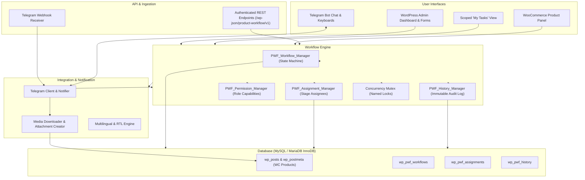
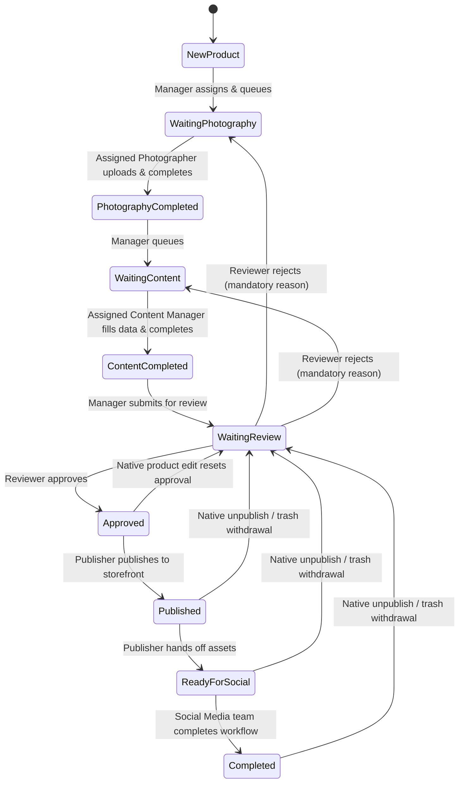
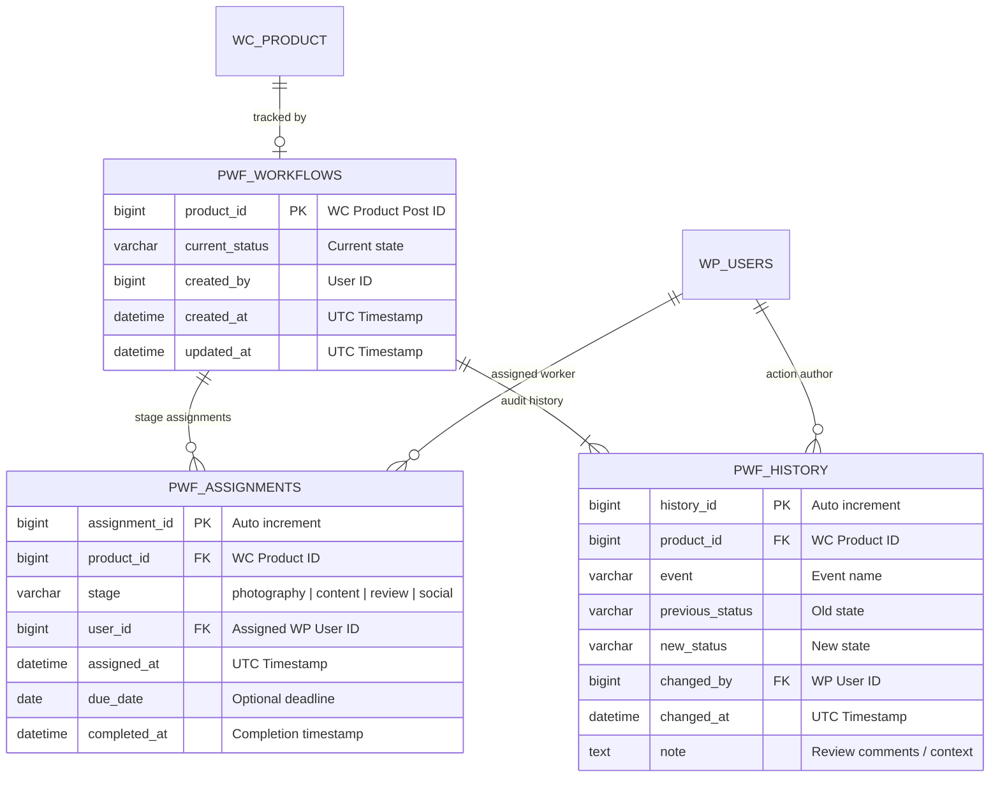

# Product Workflow Architecture & Technical Design

This document details the architectural foundation, data models, state machine, and integration layers of **Product Workflow for WooCommerce**.

---

## Architecture Overview

Product Workflow is built as a modular, decoupled extension for WooCommerce. It isolates content preparation and media workflows while preserving standard WooCommerce data integrity.

---

## State Machine & Lifecycle

The product lifecycle consists of an explicit, auditable 9-stage state machine:

### Transition Guard Rules

1. **Permission Check**: Every transition requires the actor to have the corresponding capability (`upload_product_images`, `edit_product_content`, `review_product`, `publish_product`, `complete_social_task`, or `manage_workflow`).
2. **Assignment Ownership**: Workers can only act on products currently assigned to them.
3. **Product Readiness**: Content completion, review approval, and publication require mandatory product fields:
   - Product title / name
   - SKU
   - Description
   - Regular price
   - Main featured image
   - Category
4. **Mandatory Rejection Notes**: When a reviewer returns a product to photography or content, a detailed explanatory reason is required and recorded in the audit history.
5. **Concurrency Serialization**: Transitions use MySQL named locks (`GET_LOCK`) and atomic InnoDB database transactions to guarantee that simultaneous requests never corrupt state.

---

## Data Model & Schema

All workflow tables use the MySQL **InnoDB** storage engine with UTF-8mb4 collations.

---

## Telegram Integration Architecture

The Telegram integration (`integrations/class-telegram.php` and `integrations/telegram/services/`) provides real-time notifications and bot interactions:

- **Client & Webhook**: Communicates with the Telegram Bot API (`sendMessage`, `sendPhoto`, `getFile`). Webhooks receive updates routed securely to `/wp-json/product-workflow/v1/telegram-webhook`.
- **Notifier**: Hooks into `pwf_workflow_event` after successful database commits. Broadcasts public announcements to the configured default channel, while delivering targeted alerts to the assigned user's personal `telegram_chat_id`.
- **Interactive Bot Commands**:
  - `/start`: Onboards users, displays personalized role menu.
  - `/tasks`: Shows active tasks assigned to the Telegram user with direct command buttons.
  - `/photo_{id}`: Initiates photo upload mode; downloads photos sent to the bot directly into the WordPress Media Library attached to the product.
  - `/done_photo_{id}` or completion buttons: Advances product status to `waiting_content` and notifies the next queue.
- **Fail-Safe Isolation**: Any network or API failure communicating with Telegram is safely logged and caught; Telegram failures **never** abort or roll back saved WordPress workflow changes.

---

## Role-Based Access Control (RBAC)

| Role | Core Capabilities |
| --- | --- |
| **Factory (`pwf_factory`)** | `create_product_request`, `view_assigned_products` |
| **Photographer (`pwf_photographer`)** | `upload_product_images`, `complete_photography_task`, `view_assigned_products` |
| **Content Manager (`pwf_content_manager`)** | `edit_product_content`, `complete_content_task`, `view_assigned_products` |
| **Reviewer (`pwf_reviewer`)** | `review_product`, `view_assigned_products` |
| **Social Media (`pwf_social`)** | `complete_social_task`, `view_assigned_products` |
| **Shop Manager / Administrator** | All above, plus `assign_tasks`, `manage_workflow`, `publish_product` |

---

## Internationalization & Localization

- Translation dictionary managed in `languages/{locale}.json`.
- Supported locales: English (`en_US`), Persian (`fa_IR`), Italian (`it_IT`).
- RTL support dynamically applied when viewing in Persian or other RTL languages.
